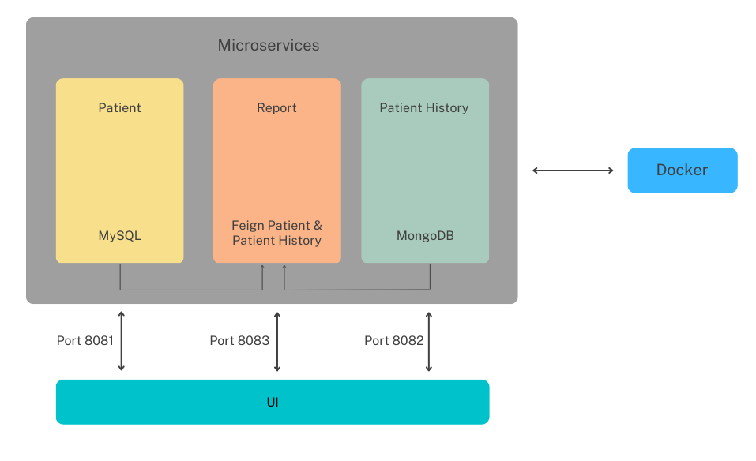

____________________

# Mediscreen Application
> -- _Mediscreen is a Spring Boot application that is specialized in detecting risk factors for disease._ --

## Architecture

The architecture Overview of Mediscreen:




## To install
### Prerequisites
- Java 11 : https://www.oracle.com/java/technologies/downloads/#license-lightbox
- maven (installed with IDE)
- git (installed with IDE)
- Docker : https://docs.docker.com/docker-for-windows/install/

### Steps
- clone repository
`git clone https://github.com/simoncourtecuisse/Mediscreen.git`

- Launch the command for generate the JARs : `mvn clean install`
- Build each image using the DockerFile included in each micro-service folder (must be in the right folder to launch the command) :
`
docker build -t mediscreen-patient .
docker build -t mediscreen-patienthistory .
docker build -t mediscreen-report .
docker build -t mediscreen-ui .
`

## Run the application

To start the application, run the command:
```
./gradlew bootRun
```

## Endpoints
> **GET** - Index: http://localhost:8080/
> 
> **GET** - Get User Location: http://localhost:8080/getLocation?userName=
> _Add username after equal sign_
> 
> **GET** - Get nearby attractions: http://localhost:8080/getNearbyAttractions?userName=
> _Add username after equal sign_
> 
> **GET** - Get five nearby attractions: http://localhost:8080/getFiveAttractions?userName=
> _Add username after equal sign_
> 
> **GET** - Get reward points for a user: http://localhost:8080/getRewards?userName=
> _Add username after equal sign_
> 
> **GET** - Get all current users locations: http://localhost:8080/getAllCurrentLocations
> 
> **GET** - Get trip deals for a user: http://localhost:8080/getTripDeals?userName=
> _Add username after equal sign_
> 
> **PUT** - Update user preferences: http://localhost:8080/userPreferences
> _userPreferencesDTO body needed_
> 
> **GET** - Get User Info: http://localhost:8080/getUser?userName=
> _Add username after equal sign_

## Tests
TourGuide has a full integration and unit test suite. You can launch it with the following command:

```
./gradlew test
```
Or for running the tests inside your IDE, follow the link below:
[Work with tests in Gradle](https://www.jetbrains.com/help/idea/work-with-tests-in-gradle.html#configure_gradle_test_runner).

## Reports
JaCoCo reporting tools are attached to the gradle configuration. Launch these two commands to run the tools:
```
./gradlew jacocoTestReport
```
```
./gradlew jacocoTestCoverageVerification
```

## Build the application

To build the application, run the command:
```
./gradlew bootJar
```


